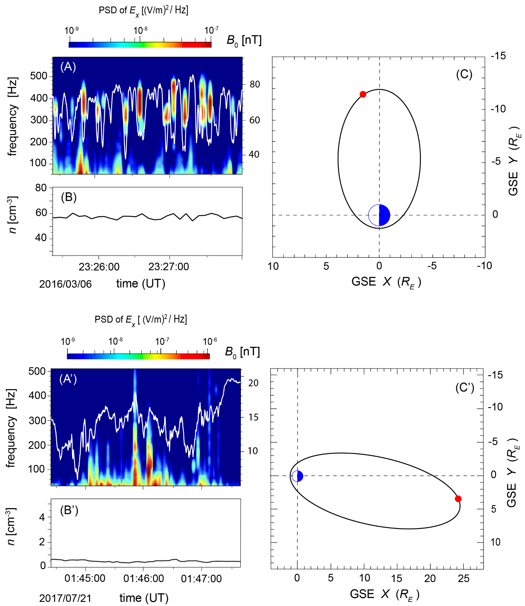
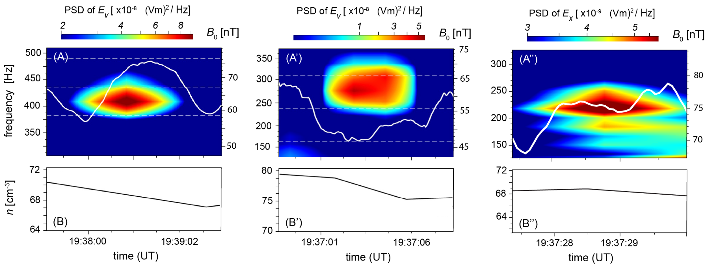

# Magnetospheric B-Duct Detection

This project is a prototype pipeline for AI-enabled detection and characterization of magnetospheric ducting structures from MMS observations.

## Example duct signatures

**Series of Detected Events in (A) Flank, and (A') Magnetotail of Magnetosphere**
<p align="center">
  
</p>

<p align="center"><sub>Detected duct candidates used as examples for the AI detection workflow.</sub></p>


<p align="center">
  
</p>

**Observed (A) High-magnetic, (A') Low-Magnetic, and (A'') Magnetic-Shelf Events**

<p align="center">
  
</p>


## Workflow

- Identify observation intervals that contain possible magnetospheric duct signatures.
- Extract event-centered magnetic-field and plasma-density structures.
- Use the extracted samples to train and test AI models for individual duct detection.
- Compare detected events with observed duct signatures across different regions of the magnetosphere.

## Status

Research prototype under development. The project currently focuses on organizing duct-event samples, preparing detected-event examples, and building an AI workflow for identifying individual magnetospheric ducting structures from observational data.

## Repository status
- **Current maturity:** structured research prototype suitable for a TRL 4–5 starting point
- **Legacy development notebooks:** preserved under `archive/legacy_notebooks/`
- **Public-facing workflow notebooks:** kept in `notebooks/` and aligned to the packaged code in `src/`

## Pipeline stages
1. **Data ingestion** – download MMS products, interpolate to a common timeline, and export interval products.
2. **Event dataset construction** – build event-centered NetCDF samples and quicklook plots.
3. **Feature preparation** – convert event samples into ML-ready tabular features and spectrogram tensors.
4. **Model development** – train baseline and advanced models from prepared arrays.

## Quick start
```bash
pip install -e .
```

## Main workflow notebooks
- `notebooks/01_mms_data_ingest_interpolation.ipynb`
- `notebooks/02_event_dataset_and_quicklooks.ipynb`
- `notebooks/03_feature_preparation.ipynb`
- `notebooks/04_model_random_forest.ipynb`

## Labels
Model training requires a label table. A template is provided at `labels/example_event_labels.csv` with columns:
- `file`
- `label`

## Notes
- Large data products are intentionally excluded from version control.
- Historical notebooks are retained for development traceability but should not be treated as the current workflow.
